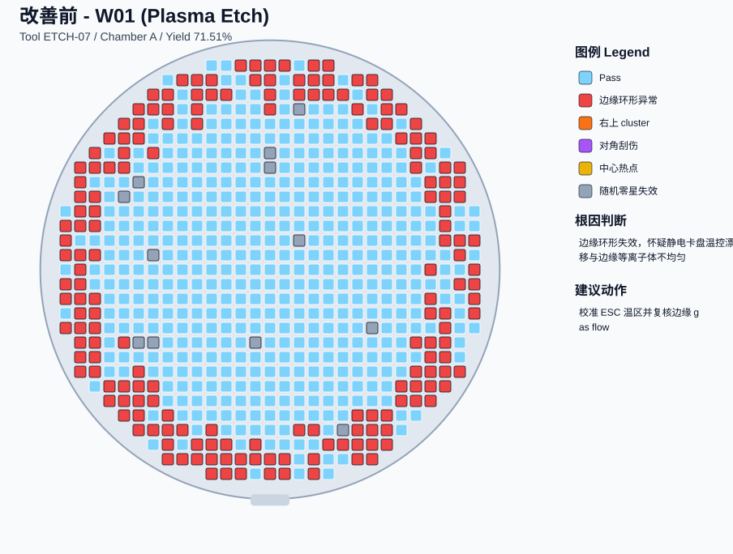
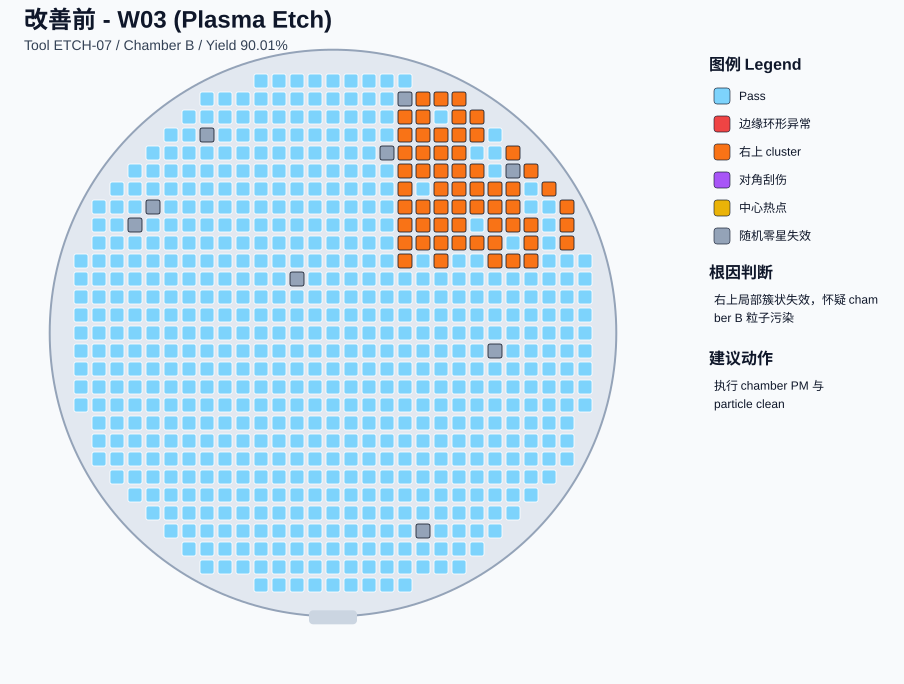
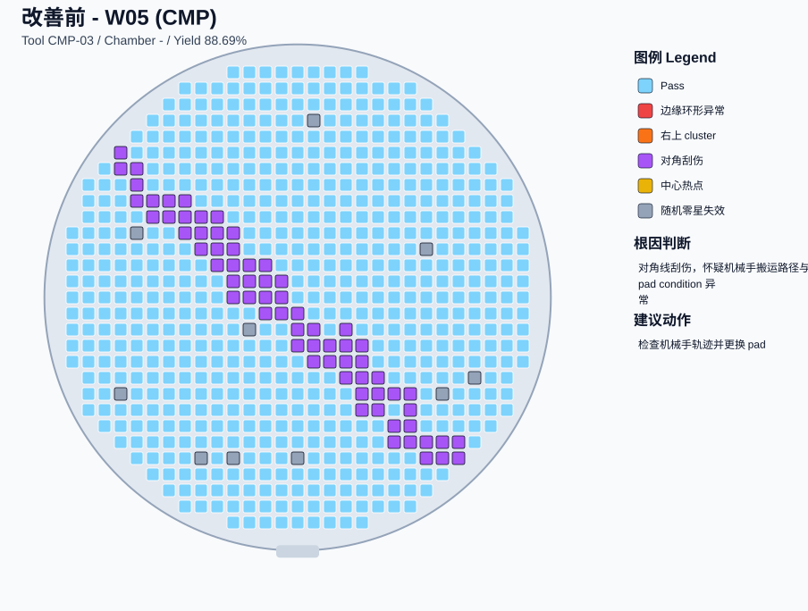
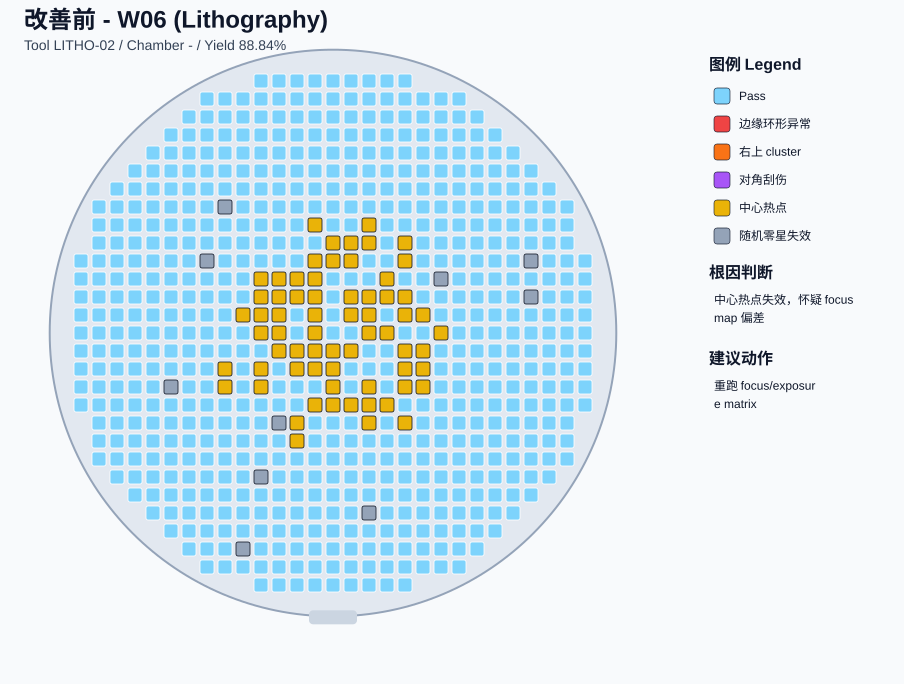
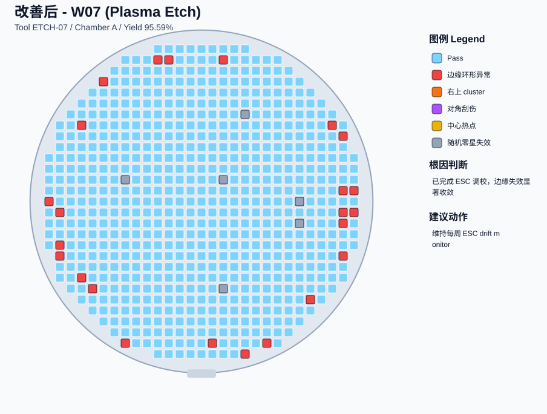
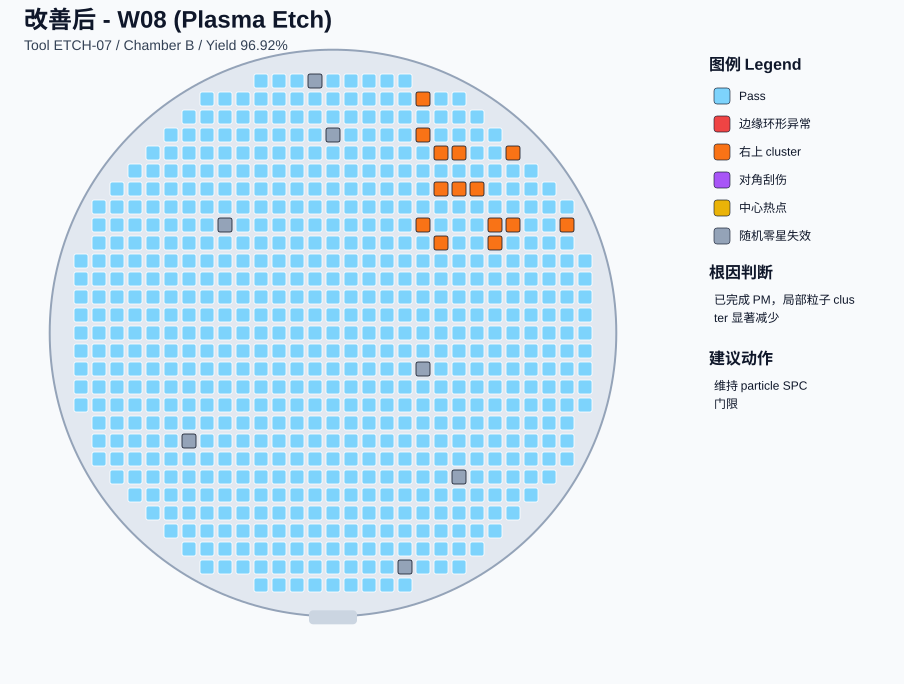
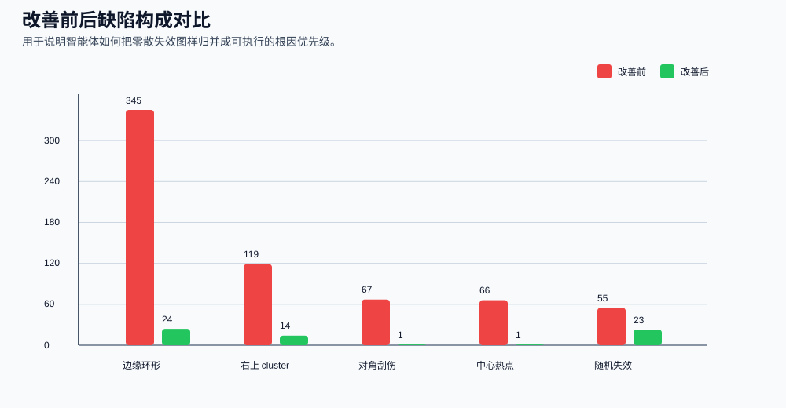
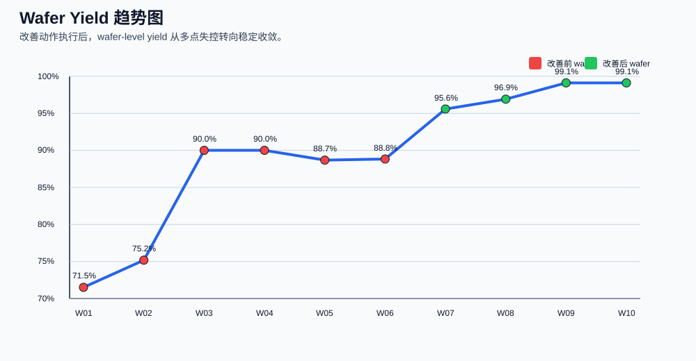

# 半导体良率根因分析智能体 Demo

这个 demo 面向**长期深耕半导体制造、但对 AI / 大模型 / 智能体不熟悉的管理者**，用合成数据演示智能体如何从 wafer map 图样中识别根因、给出改善动作，并量化良率提升。

## 1. Demo 想传达的核心价值

- **自动化**：自动汇总 MES、设备、缺陷、wafer map 等多源数据，减少工程师人工翻图与做 PPT 的时间。
- **智能化**：将 ring、cluster、scratch、center hotspot 等典型图样自动归类，并关联可能的设备/工艺原因。
- **可执行**：不仅告诉你“哪里坏了”，还输出“先做什么动作、预期能提升多少良率”。
- **可管理**：把零散的工程问题转换成管理层容易理解的三件事：问题规模、优先级、改善收益。

## 2. 合成数据说明

- 产品：28nm MCU。
- 对象：10 片 wafer，其中 6 片为改善前、4 片为改善后。
- Die 数量：每片 697 颗有效 die（按圆形 wafer 区域近似生成）。
- 典型失效图样：边缘环形异常、右上 cluster、对角刮伤、中心热点、随机零星失效。
- 主要目的：用于汇报演示，不代表真实 fab 数据。

## 3. 关键结论（适合汇报时先讲）

- 改善前平均良率约 **84.04%**，改善后提升到 **97.69%**，平均提升 **13.65 个百分点**。
- 良率波动（sigma）从 **7.65** 收敛到 **1.51**，说明不只是均值提升，稳定性也更好。
- 主要损失来源从边缘 ring 与局部 cluster，转为少量随机失效；这说明关键系统性问题已被压制。
- 这类任务很适合做成智能体：输入 wafer map + 设备/工艺上下文，输出根因优先级、建议动作、预估收益。

## 4. 代表性 Wafer Map

### 4.1 改善前：边缘 ring 异常（疑似 ESC 温控 / 边缘 plasma 不均）

### 4.2 改善前：右上局部 cluster（疑似 chamber particle）

### 4.3 改善前：对角刮伤（疑似机械手 / pad condition）

### 4.4 改善前：中心 hotspot（疑似 litho focus map 偏移）

### 4.5 改善后：边缘 ring 明显收敛

### 4.6 改善后：cluster 仅剩零星分布

## 5. 对比图

### 5.1 缺陷构成对比

### 5.2 Yield 趋势

## 6. 对比分析（可以直接讲给领导听）

### 6.1 改善前发生了什么

- **W01 / W02** 出现明显边缘 ring，说明问题不像随机波动，更像是设备状态或工艺窗口系统性偏移。
- **W03 / W04** 右上 cluster 反复出现，而且集中在同一 chamber，说明可以优先排查粒子污染而不是到处撒网。
- **W05** 的对角线失效很像机械伤或 pad-related 轨迹问题，属于典型模式识别能快速定位的问题。
- **W06** 中心热点说明 litho focus/exposure 的空间分布失衡，不是简单单点参数漂移。

### 6.2 智能体能怎么做

1. 自动读取 wafer map，并识别图样属于 ring / cluster / scratch / hotspot 中哪一类。
2. 自动拉取对应 lot 的工艺履历、tool/chamber、SPC、FDC 告警和 PM 记录。
3. 根据历史案例库给出**根因优先级列表**，例如：ESC 温控漂移 > particle 污染 > 机械手路径异常。
4. 生成工程建议：先校准什么、先 clean 哪台机、先看哪一个 SPC 指标。
5. 估算收益：若优先处理前两大根因，平均良率可从 80%+ 提升到 95%+。

### 6.3 管理层能看到的价值

- 以前：工程师靠经验看图、拉数据、开会讨论，往往要几小时到几天。
- 以后：智能体几分钟内形成首版结论，工程师重点变成确认与执行。
- 对领导的意义不是“替代工程师”，而是让优秀工程经验可复制、可沉淀、可规模化。

## 7. 建议你汇报时的讲法

可以按下面这 4 句话展开：

1. **第一句话：** 智能体不是一个聊天机器人，而是一个会自动看 wafer map、查设备履历、给出改善建议的数字工程师助理。
2. **第二句话：** 它最适合先做高频、重复、依赖经验的环节，比如良率根因分析。
3. **第三句话：** 这个 demo 展示了它能把几个典型图样快速归因，并把良率从 80%+ 拉升到 95%+。
4. **第四句话：** 真正落地后，它会沉淀成企业自己的工程知识系统，而不是一次性工具。

## 8. 文件说明

- `scripts/generate_semiconductor_demo.py`：生成合成数据、wafer map 和对比图。
- `demo_output/data/wafer_die_data.csv`：die-level 合成数据。
- `demo_output/data/wafer_summary.csv`：wafer-level 汇总数据。
- `demo_output/images/*.svg`：可直接插入汇报材料的图。
